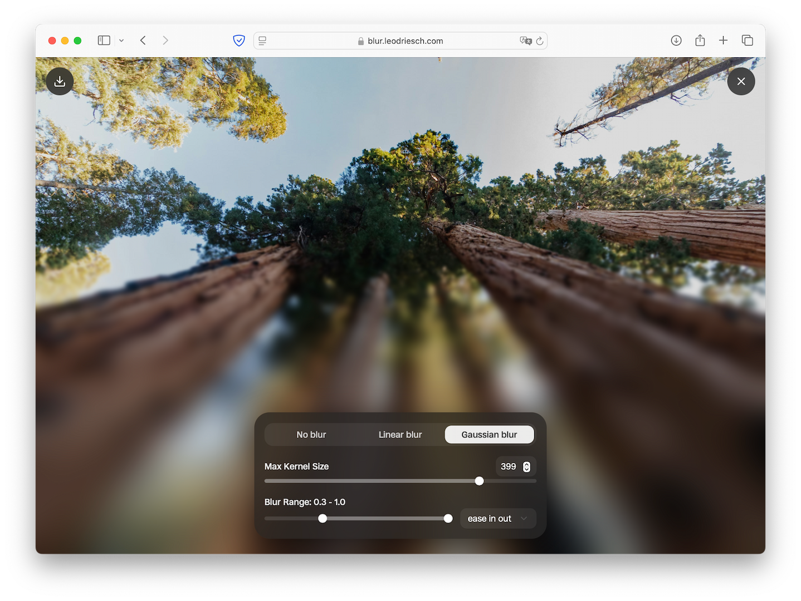

<div align="center">

# Progressive Blur

A powerful and interactive image blur effect generator with real-time GPU-accelerated processing.



</div>

## [Try it live →](https://blur.leodriesch.com)

## Features

- **GPU-Accelerated Blur**: Utilizes WebGL2 for high-performance image processing
- **Progressive Blur Effect**: Apply a gradient blur that increases in intensity across the image
- **Customizable Settings**:
  - Adjust blur start and end points
  - Control maximum blur intensity
  - Choose between linear and Gaussian blur algorithms
  - Select from multiple easing functions for smooth transitions
- **Simple Interface**: Drag and drop images or use the file picker
- **Download Results**: Save your processed images with one click

## How It Works

Progressive Blur applies a dynamic blur effect that gradually increases in intensity across your image. The effect is rendered in real-time using WebGL shaders, providing smooth performance even with large images and high blur values.

## Technical Implementation

- Built with React and TypeScript
- Uses Web Workers for non-blocking UI performance
- Implements custom WebGL2 shaders for efficient blur algorithms
- Responsive design that works across devices

## Development

To run the project locally:

```bash
# Install dependencies
npm install

# Start development server
npm run dev

# Build for production
npm run build
```

## License

MIT
